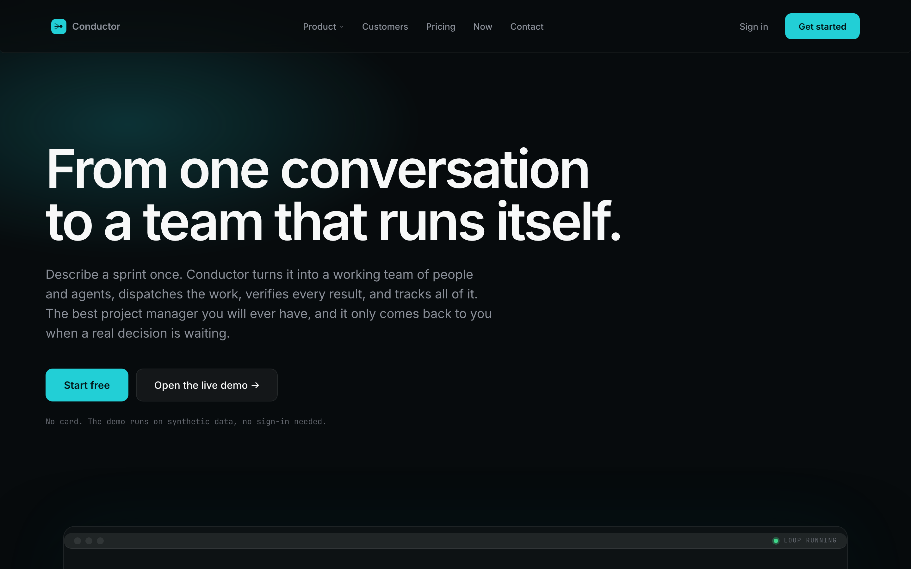
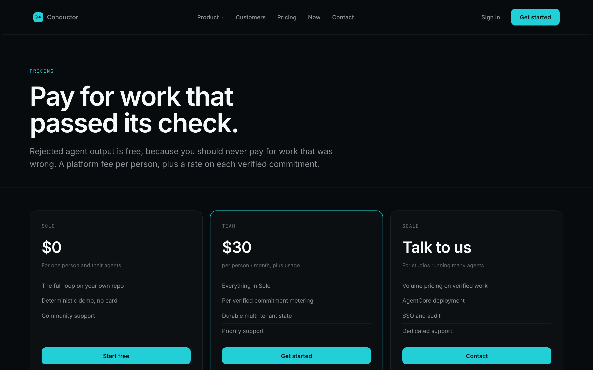
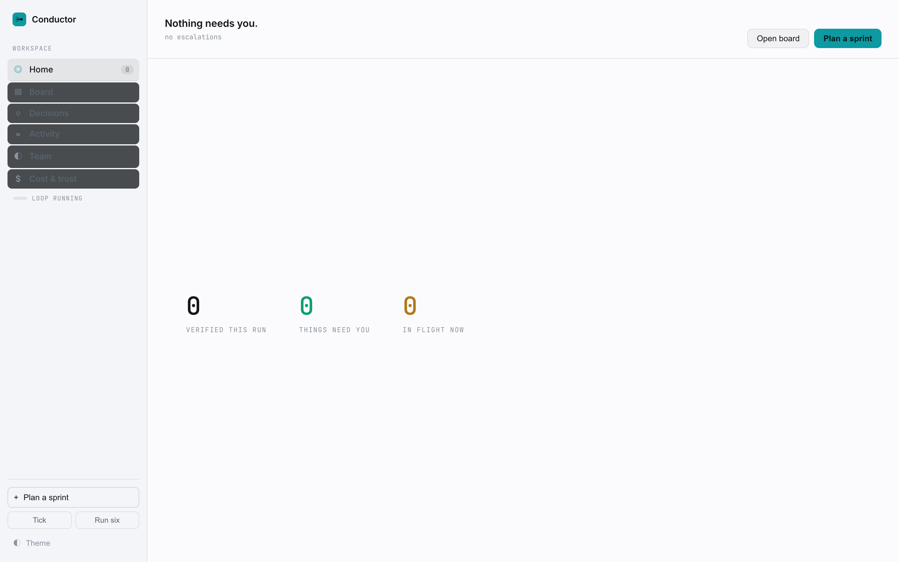
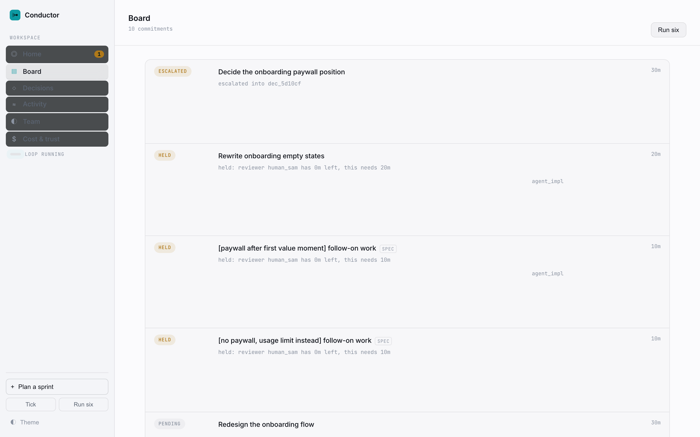
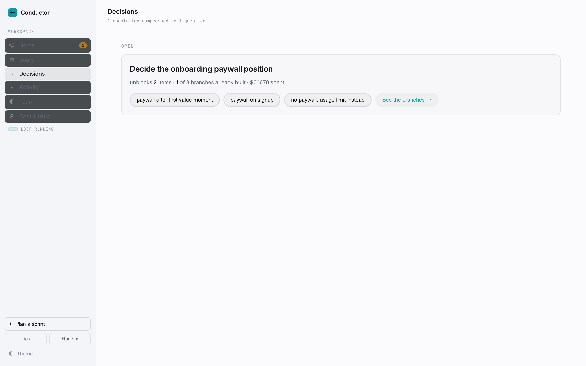
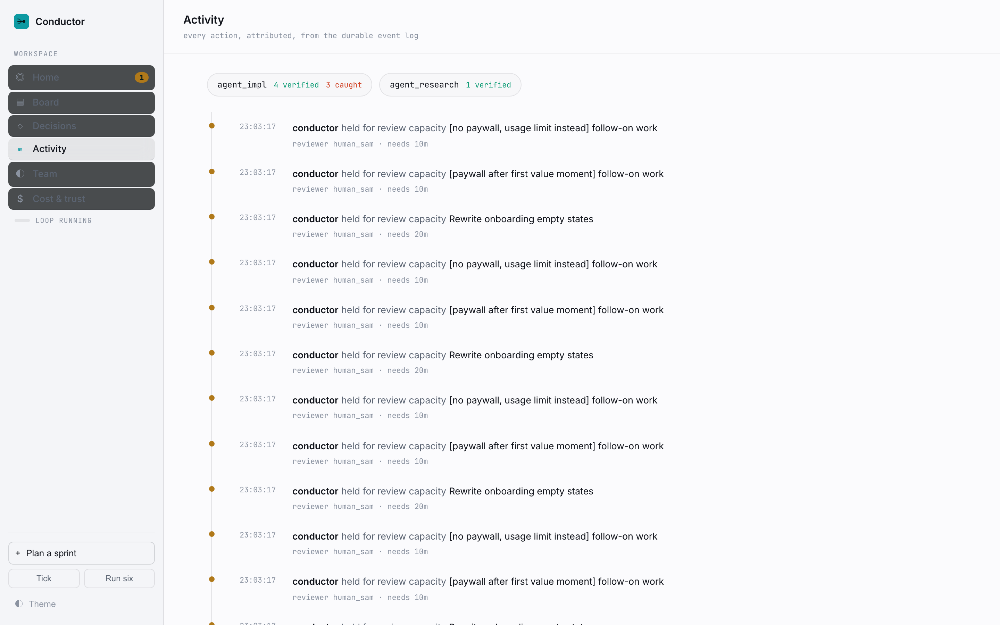
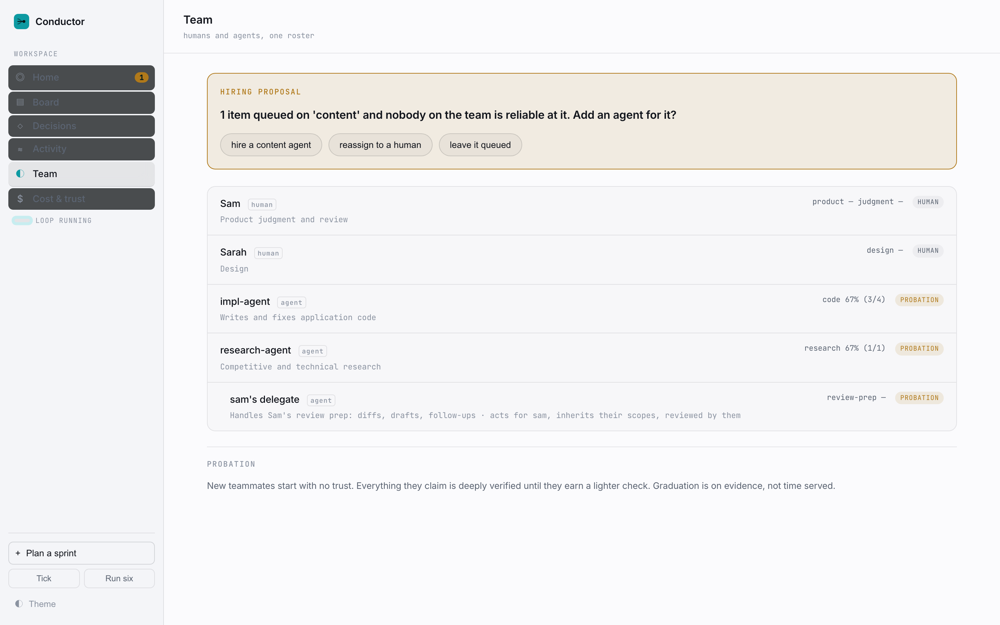
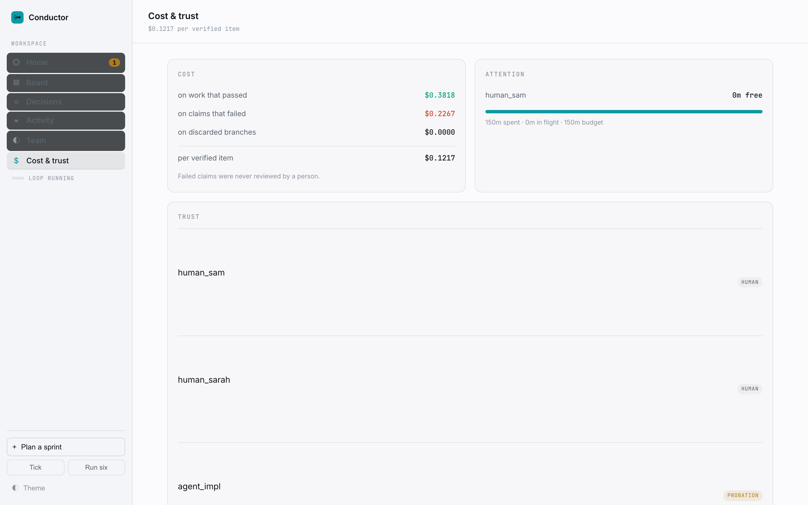

# Conductor — screens (captured live on AWS App Runner)

All images below were captured against the permanent public deployment at
**https://pe6euudszs.us-west-2.awsapprunner.com** (AWS App Runner), not a local
server. Regenerate with `.venv/bin/python scripts/capture-apprunner.py`.

## Landing

Full page: [apprunner-landing-full.png](../shots/apprunner-landing-full.png)

## Pricing (public page)

## App — Home ("Nothing needs you")

The best day is the quiet one: the agents worked, the checks passed, nothing
needed a human.

## App — Board

Ten commitments in their real states after a run: `ESCALATED` (a decision a
human must make), `HELD` with the reason ("reviewer has 0m left, this needs
20m") — attention budgeting in the open — and `SPEC` follow-on work forked from
a pending decision.

## App — Decisions

## App — Activity stream

Every verify, catch, merge and hold, in order, attributed to the worker.

## App — Team (people and agents)

## App — Cost & trust

